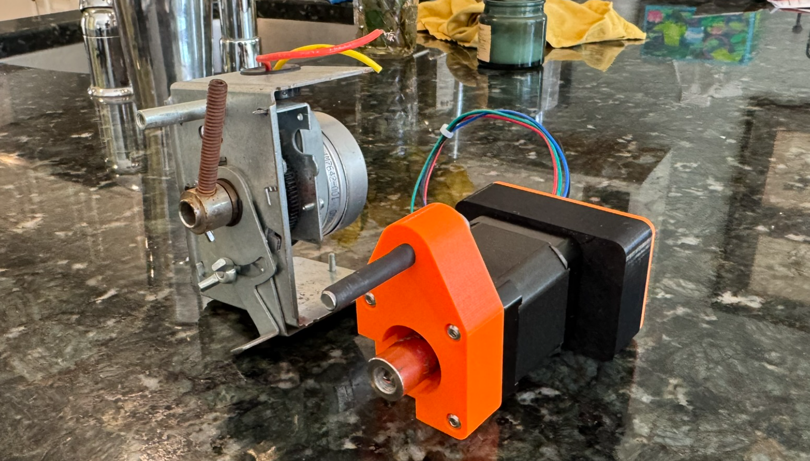

# A PID-based Damper To Replace Honeywell Damper Motors

## Components

The solution has the following hardware and software components:

* [VAL3000 Controller](https://github.com/Valar-Systems/VAL3000)  
* A [STEPPERONLINE NEMA-17 Motor](https://www.amazon.com/dp/B00PNEQKC0)  
* 3D Printed Mount and PCB case  
* An [8mm-\>5mm collar](https://a.co/d/04N5h7Px)  
* Two (2) M3 x 50mm pan head bolts to mount PCB case  
* Four (4) M3 x 20 hex bolts to mount the bracket  
* One (1) M4 x 20 hex bolt as a StallGuard stop  
* [Simple PID integration from HACS](https://github.com/bvweerd/simple_pid_controller)  
* Home Assistant with yaml file for ESPhome & automations

## Rationale & Approach

Heat and AC on our 2nd floor is poorly distributed.  A single large vent that feeds 4 outlets in our master bedroom and bath represents about 50% of the floor’s airflow while the remaining 50% feeds 3 bedrooms and 2 baths via a series of 12 inch flex vents.  Insufficient air flow feeds these guest rooms.

Some attic exploring discovered a non-functioning damper on the master bedroom duct so we proceeded with replacing the defunct Honeywell M847D1012 & M847D-ZONE motor with a positioning stepper motor. Combining this stepper with an ESPHome device, and a simple PID controller, we hoped for a chance to level the heating/cooling field.

For starters, a few assumptions:

1. We will configure ESPHome using HA’s cover and number templates.  HA’s ‘cover’ lets us fully open, stop, and close the damper.   HA’s ‘number’ allows us to set the damper to any opening level.  Dampers are a 90 degree device.  Since we’re using 8 microsteps on a 200 step/revolution motor, a full rotation is 1600 so 90 degrees is 400 steps.   Leaving 20 steps as margin, our damper has an “OPEN” value of 20 steps and “CLOSED” is 380\.  We also used Trinamic’s StallGuard technology.  I recommend you stick with the StallGuard parameters provided.  
2. For this stack, we set:  
   a. The input as the difference between the master bedroom thermostat (T1) and one of the guest bedrooms (T2). T1 \- T2 (aka ‘error’)
   b. Delta sensor — mode-aware, reverses math for heat/cool, returns 0 when off
   c. PID controller — kp: -36.0 ki: -0.5 kd: -5.0, setpoint 0 
   d. Position accumulator — input_number.damper_position min:20 max:380 initial:20
   e. Stepper action — absolute PID output, clamped and sent to both accumulator and stepper
   f. Negative gains provide inverted PID convention in hass-pid-controller

3. There's also an automate that turns on/off the PID controller if the thermostat (via climate entity) is off and on otherwise.

View the README files in the individual sub-directories for greater detail on this implementation.  You might have to tune the Kp, Ki, & Kd gains to match your installation.

## Components

### Hardware 

I like the STEPPERONLINE motor.   For \~$15, it’s powerful and reliable.   Valar System’s VAL3000 is a robust, elegant ESP32 PCB integrated with a Trinamic 2209 controller.  This board made this project easy and I highly recommend it.  I decreased the current by 50% by setting the irun value for the TMC220 to 15.

3D printed cases are OpenSCAD designs.  STL files are also provided.  See above bolts to attach them.

### Software

Home Assistant is required and you will need to create and modify 4 home assistant files:

* A ESPhome Builder damper.yaml configuration file  
* If you want to fiddle with the StallGuard4 parameters, use the ESPhome Builder testing get-tstep.yaml file to obtain the TSTEP values of your damper controller.  
* An automation, pid2controller.yaml to write the PID output to the control\_stepper number.  This is a bit tricky as I’ve learned because the PID output state doesn’t change if the value remains the same so it’s timer \- not state-based.  
* An automation, handleClimate.yaml to enable or disable the PID controller based on the thermostat setting (heat or off).  The simple PID integration I used has an Auto-Mode\!

## Reference Materials

This is a hodge podge of sites that I used to understand the various aspects of this project.  Shout out to [Daniel](https://github.com/daniel-frenkel/Valar-Systems) at Valar Systems and [Christian](https://github.com/slimcdk) for his ESPHome contributions.  Daniel’s book on working with stepper motors was a huge help \- get a copy of it if you can\!

### API between ESPhome and HA:

[https://esphome.io/components/api/\#:\~:text=After%20adding%20an%20api:%20line,will%20only%20refer%20to%20Actions](https://esphome.io/components/api/#:~:text=After%20adding%20an%20api:%20line,will%20only%20refer%20to%20Actions).  
[https://esphome.io/components/stepper/](https://esphome.io/components/stepper/)  
[TMC2009 & ESPHome](https://github.com/slimcdk/esphome-custom-components/tree/11b380a829b23ce5282488113e5af97a6d5236ad/esphome/components/tmc2209)

### UART wiring

[https://forum.arduino.cc/t/tmc2209-and-esp32-uart-wiring/1362812/17](https://forum.arduino.cc/t/tmc2209-and-esp32-uart-wiring/1362812/17)  
[https://github.com/bigtreetech/BIGTREETECH-TMC2209-V1.2/blob/master/manual/TMC2209-V1.2-manual.pdf](https://github.com/bigtreetech/BIGTREETECH-TMC2209-V1.2/blob/master/manual/TMC2209-V1.2-manual.pdf)

### Community Contributions

[Having motor go to position based on input box](https://community.home-assistant.io/t/is-it-possible-to-control-a-stepper-through-a-box-input-number/476943).  
[https://www.reddit.com/r/homeassistant/comments/1qreal5/comment/o2p8kz4/](https://www.reddit.com/r/homeassistant/comments/1qreal5/comment/o2p8kz4/)  
[Stepper Component \- ESPHome \- Smart Home Made Simple](https://esphome.io/components/stepper/#home-assistant-configuration)  
[ESP32 Wi-Fi Stepper Motor Driver : r/diyelectronics](https://www.reddit.com/r/diyelectronics/comments/1p7i9f4/esp32_wifi_stepper_motor_driver/)  
[https://valarsystems.com/products/val3000](https://valarsystems.com/products/val3000) & [https://www.youtube.com/shorts/FnWmoFnG2Ak](https://www.youtube.com/shorts/FnWmoFnG2Ak)  
[https://community.home-assistant.io/t/motorized-inline-hvac-damper-for-zone-control/872555](https://community.home-assistant.io/t/motorized-inline-hvac-damper-for-zone-control/872555)  
[Arduino & TMC & UART woes](https://forum.arduino.cc/t/using-a-tmc2209-silent-stepper-motor-driver-with-an-arduino/666992/10)

[https://www.reddit.com/r/Esphome/comments/1qxsh61/got\_my\_stepper\_driver\_integrated\_with\_esphome/](https://www.reddit.com/r/Esphome/comments/1qxsh61/got_my_stepper_driver_integrated_with_esphome/)  
TMC2209 Support  
[https://github.com/slimcdk/esphome-custom-components/tree/master/esphome/components/tmc2209](https://github.com/slimcdk/esphome-custom-components/tree/master/esphome/components/tmc2209)  
[https://valarsystems.com/products/val3000](https://valarsystems.com/products/val3000)

### Basic homing in esphome:

[https://www.reddit.com/r/homeassistant/comments/1qxt8o1/thanks\_guys\_my\_stepper\_driver\_now\_works\_with/](https://www.reddit.com/r/homeassistant/comments/1qxt8o1/thanks_guys_my_stepper_driver_now_works_with/)  
[https://www.reddit.com/user/nutstobutts/](https://www.reddit.com/user/nutstobutts/)  
[https://www.reddit.com/user/c7ndk/](https://www.reddit.com/user/c7ndk/)  
[https://www.reddit.com/r/homeassistant/comments/1qreal5/comment/o38b9ty/?context=3](https://www.reddit.com/r/homeassistant/comments/1qreal5/comment/o38b9ty/?context=3)  
[https://www.reddit.com/r/homeassistant/comments/1qreal5/comment/o38b9ty/?context=3](https://www.reddit.com/r/homeassistant/comments/1qreal5/comment/o38b9ty/?context=3)  
[https://github.com/slimcdk/esphome-custom-components/blob/master/esphome/components/tmc2209/README.md\#sensorless-homing](https://github.com/slimcdk/esphome-custom-components/blob/master/esphome/components/tmc2209/README.md#sensorless-homing)  
[https://github.com/AndreaFavero71/stepper\_sensorless\_homing](https://github.com/AndreaFavero71/stepper_sensorless_homing)
